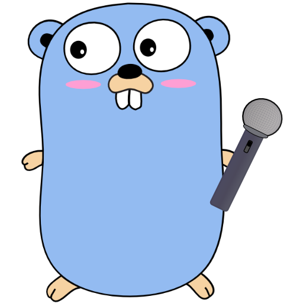

# Kyabia - **K**araoke **Vi**deo **Ar**biter



A simple wishlist system for Karaoke events. Provides a song database as well as a playlist for upcoming songs.
The song database can be auto-filled by scraping video files from local directories.

## Installation

### Binary distribution

**Attention**:
For scraping the video files, Kyabia uses `ffmpeg` - or to be more exact - the `ffprobe` command shipped together with ffmpeg. Make sure you have `ffmpeg` installed on your machine, before running Kyabia.

Just download the archive for your operating system and extract it to the directory of choice.<br/>
Kyabia can then directly be run from within that folder:
```
> ./kyabia
```
By default, it will search for a `config.json` file inside the current working directory. A good starting point for a configuration file is the `config.json.tpl` also contaied in the release archive.

#### User database

Until Kyabia gets a user database implementation, only one user can be defined from within the configuration file.
This user is intended to be used by the Karaoke event host(s) in order to manage the playlist(s) and scan the video files.

### Build from source

After cloning the repository via 
```
git clone https://github.com/derWhity/kyabia.git
```
the software can directly be built by using the
```
go build
```
command from within the repository. Go will automatically download and compile all dependencies.

In order to have a working UI for Kyabia, the web UI should also be cloned from https://github.com/derWhity/kyabia-web
and built according to its README.md. The resulting build from inside the `dist` folder then needs to be copied into 
a directory named `ui` residing in the same folder as the kyabia binary.

## Notes

The [Go gopher](https://blog.golang.org/gopher) used as base for this project's logo was originally designed by [Renee French](http://reneefrench.blogspot.com/) and licensed as Creative Commons Attribution 3.0